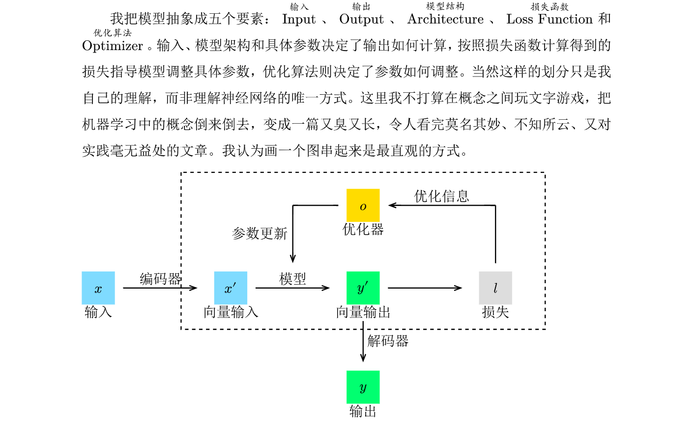

## 为什么要写这个

许多人在学习机器学习时都会感到教材教的不太自然，不太好理解。很多时候我们很难理解为什么要这么做，为什么这么做就能得到结果。与其教会大家机器学习，我想更重要的是带读者理解其中的一些动机，让读者能觉得一些操作是自然、合理的。这样在学习新的知识时，就能更容易地理解和接受。

## 关于格式

这个系列会以我自己的理解为主，时不时会穿插一些链接来引导读者去查看一些更详细的资料。如果你在文中看到了蓝色、带下划线的文字，类似 <a href="https://github.com/gtj1/understanding_nn">这样子</a>，就说明这是一个链接，点击它就能跳转到相关的资料。我会在一些专有名词上标上英文，以便读者查阅资料。有时会在文末附上一些我推荐的阅读链接，因此这个文章可能看起来像是一个用感想串起来的索引列表。

## 关于内容

这里面的内容其实算不上什么很新或者很高深的东西，大多对于专业人士来讲都是常识性质的，可是从入门到理解这些“常识”却还有一道坎，让不少人望而却步。虽然主线是机器学习，但是我会穿插一些其它的内容。

这个系列的风格大致如下：

